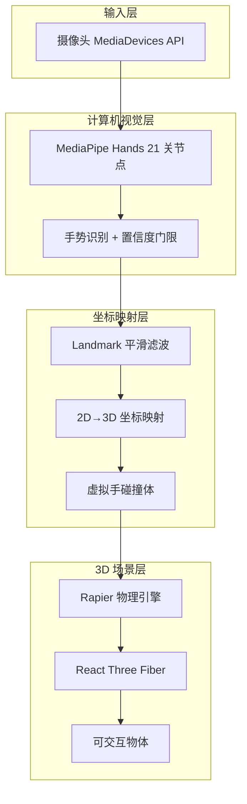

# 手势追踪 3D 交互系统架构设计

> 基于摄像头的手势识别与 3D 场景物理交互方案

## 1. 项目目标

通过浏览器摄像头识别用户手部动作，并在 3D 场景中与物体进行抓取、拖动、抛掷等交互。

## 2. 系统架构概览



## 3. 数据流（每帧）

1. 摄像头采集视频帧
2. MediaPipe Hands 输出 21 个关键点与 handedness
3. 通过置信度阈值过滤低质量识别结果
4. 对 landmark 进行平滑处理
5. 将 2D 归一化坐标映射到 3D 世界坐标
6. 更新虚拟手碰撞体位置
7. 物理引擎计算并驱动场景渲染

## 4. 核心模块与职责

### 4.1 摄像头与追踪

- `hooks/useCamera.ts`：摄像头权限与视频流
- `hooks/useHandTracking.ts`：MediaPipe 集成、稳定性增强、FPS 统计

### 4.2 手势识别

- `lib/hand-tracking/gesture-detector.ts`
  - 支持左右手判断
  - 捏合/握拳/张开/指向手势
  - 置信度门限控制

### 4.3 坐标映射

- `lib/hand-tracking/coordinate-mapper.ts`
  - 2D→3D 坐标映射
  - 平滑与速度计算工具

### 4.4 3D 场景与交互

- `components/hand-3d/Scene3D.tsx`：场景容器
- `components/hand-3d/PhysicsWorld.tsx`：物理世界
- `components/hand-3d/InteractiveScene.tsx`：抓取与交互逻辑
- `components/hand-3d/VirtualHand.tsx`：虚拟手碰撞体
- `components/hand-3d/GrabbableObjects.tsx`：可抓取物体

## 5. 当前目录结构（核心）

```
app/
  hand-3d/page.tsx
  page.tsx
components/hand-3d/
  Scene3D.tsx
  PhysicsWorld.tsx
  InteractiveScene.tsx
  VirtualHand.tsx
  GrabbableObjects.tsx
  DebugOverlay.tsx
hooks/
  useCamera.ts
  useHandTracking.ts
  useGrabbing.ts
lib/hand-tracking/
  mediapipe.ts
  gesture-detector.ts
  coordinate-mapper.ts
types/hand-tracking.ts
```

## 6. 运行入口

- 演示页面：`/hand-3d`
- 首页入口：`/`
